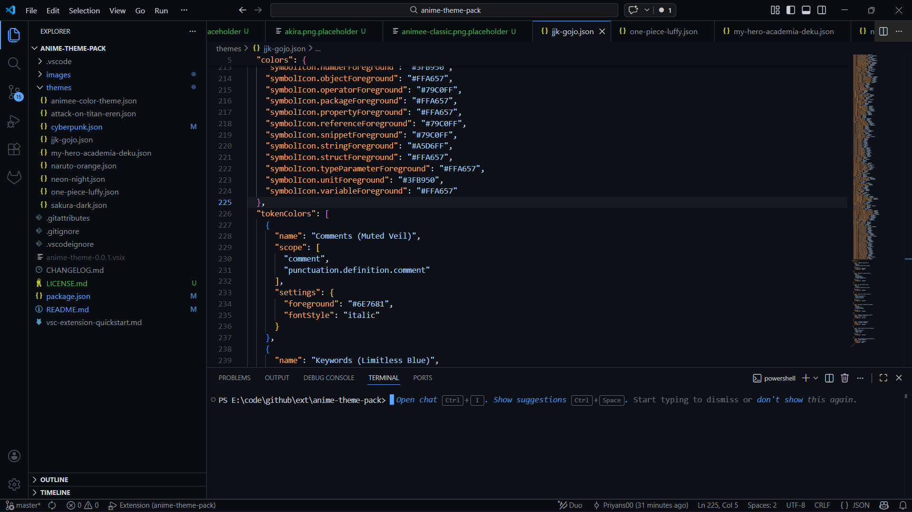
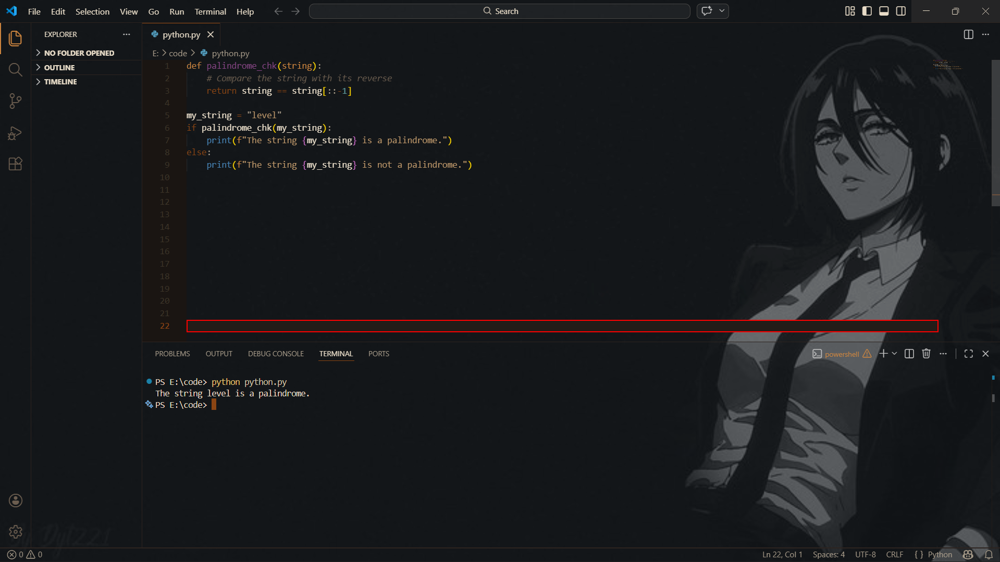
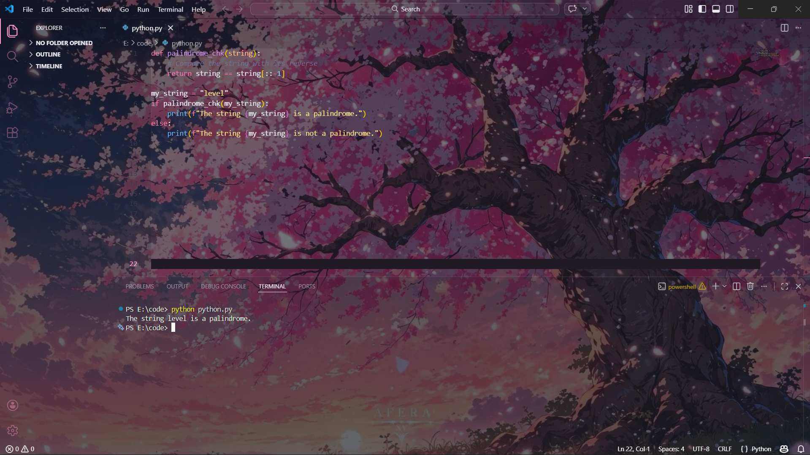
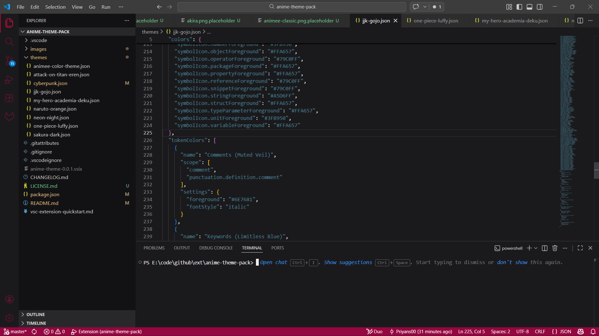
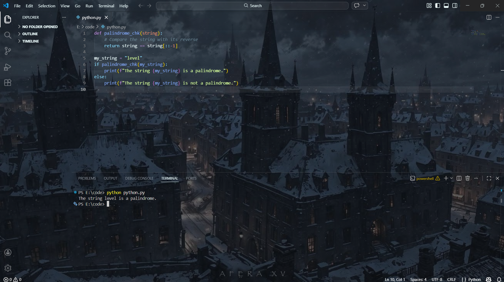
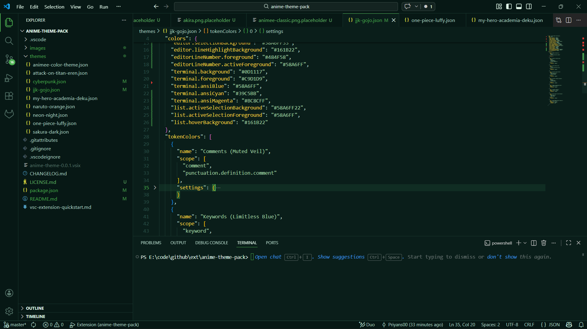
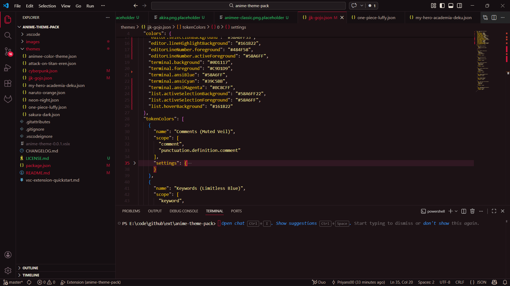
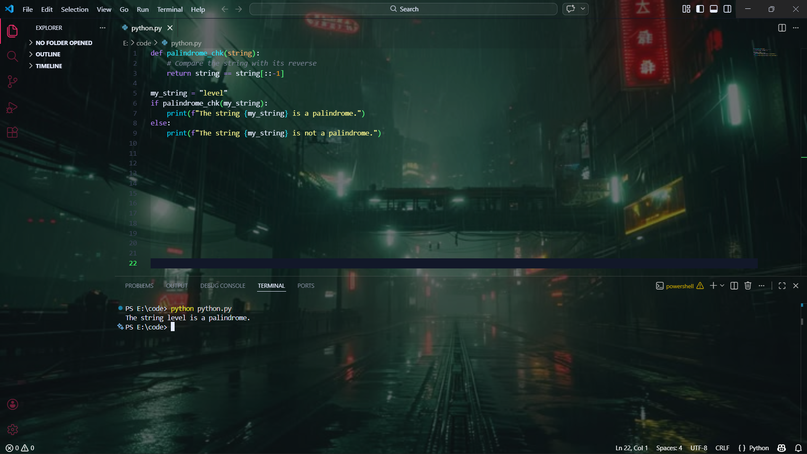
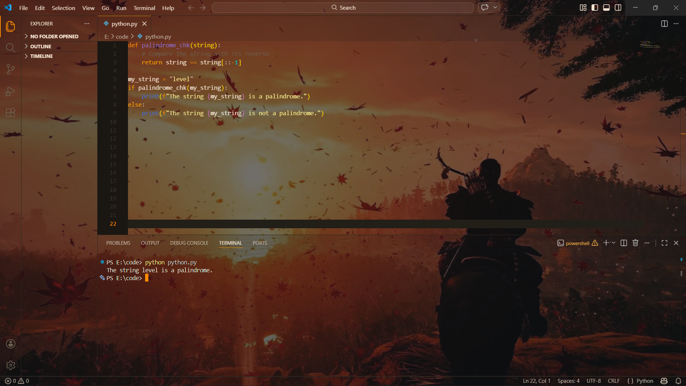

# 🎌 Anime Theme Pack – Best Anime VS Code Themes for Developers

> **9 stunning anime-inspired VS Code themes** featuring Naruto, Jujutsu Kaisen, Attack on Titan, Demon Slayer, My Hero Academia, One Piece, Cyberpunk Edgerunners, Akira, and Anime Classics — with optional immersive anime background images.

[](https://marketplace.visualstudio.com/items?itemName=LunaCode.anime-theme)
[](https://marketplace.visualstudio.com/items?itemName=LunaCode.anime-theme)
[](https://marketplace.visualstudio.com/items?itemName=LunaCode.anime-theme)
[](LICENSE.md)

If you're an anime fan who codes, this is the VS Code theme pack you've been waiting for. Each theme is meticulously crafted with **200+ color definitions**, rich syntax highlighting, full UI coverage, and custom terminal palettes — built to make long coding sessions feel like an adventure.

---

## 🎨 Theme Showcase

All 9 themes are available immediately after installation — pick your favorite or switch between them anytime.

---

### 1. Jujutsu Kaisen: Gojo Satoru



Inspired by Gojo Satoru's limitless blue and infinity aesthetic. Deep navy backgrounds with electric blue and violet accents make this one of the most popular anime VS Code themes for fans of **Jujutsu Kaisen**. Perfect for a cool, calm, and powerful coding environment.

---

### 2. Attack on Titan: Eren's Determination



Earthy browns, muted khakis, and blood-red highlights capture the raw, desperate energy of humanity's fight for freedom. This **Attack on Titan VS Code theme** is rugged, readable, and built to last.

---

### 3. Demon Slayer: Sakura Breathing



Elegant and serene. Soft sakura pinks, misty purples, and moonlit whites form a breathtakingly beautiful **Demon Slayer VS Code theme** ideal for developers who appreciate refined aesthetics.

---

### 4. Akira: Neo Town



A retro-futuristic **Akira VS Code theme** channeling Neo Tokyo's neon-drenched streets and cyberpunk chaos. Deep blacks, electric reds, and city-glow oranges for developers with a taste for classic anime history.

---

### 5. Anime Classics



A love letter to golden-age anime. Warm sepia tones, soft creams, and timeless color choices give this **Anime Classics VS Code theme** a nostalgic feel with all the readability of a modern editor.


---

### 6. My Hero Academia: Deku Plus Ultra



Go Beyond! Vibrant One For All greens, hero blues, and energetic highlights make this **My Hero Academia VS Code theme** the go-to for developers ready to tackle any challenge. PLUS ULTRA.

---

### 7. One Piece: Straw Hat Red



Set sail with Luffy's crew. Bold reds, ocean blues, and sunny yellows bring the adventure of the Grand Line straight to your editor in this action-packed **One Piece VS Code theme**.

---

### 8. Cyberpunk Edgerunners: Neon Night



Night City never sleeps. Hot pinks, electric yellows, and neon cyan pulse through this futuristic **Cyberpunk Edgerunners VS Code theme** — designed for developers who code at midnight with synthwave on full blast.

---

### 9. Naruto: Hokage Orange



Believe it! This bold **Naruto VS Code theme** channels the iconic orange Will of Fire palette alongside deep shadow blacks and leaf-green accents. Built for developers who never give up — no matter how long the debug session gets.
---


## ✨ Features

- 🎨 **9 Unique Anime VS Code Themes** — Naruto, JJK, AoT, Demon Slayer, MHA, One Piece, Cyberpunk, Akira, and Anime Classics
- 🌙 **Beautiful Dark Themes** optimized for extended coding sessions
- 🖼️ **Optional Anime Background Images** for each theme — toggle on/off with a single command
- 💻 **Rich Syntax Highlighting** across all major programming languages
- 🔍 **Semantic Highlighting Support** for TypeScript, Python, Rust, and more
- 🎭 **200+ Color Definitions** per theme for a polished, consistent experience
- 🖥️ **Full VS Code UI Coverage** — activity bar, sidebar, status bar, tabs, panels
- 🌈 **Custom Terminal Themes** — 16-color ANSI palettes matching each theme
- 🔧 **Git Decoration Colors** — modified, added, deleted, conflict indicators
- 📦 **Symbol Icon Coloring** — file types, classes, methods, and variables
- ⚙️ **Easily Customizable** via `settings.json` overrides

---

## 🚀 Installation

### From the VS Code Marketplace (Recommended)

1. Open VS Code
2. Open **Extensions** (`Ctrl+Shift+X` / `Cmd+Shift+X`)
3. Search for **"Anime Theme Pack"**
4. Click **Install**
5. Open the theme selector (`Ctrl+K Ctrl+T` / `Cmd+K Cmd+T`)
6. Choose your favorite anime theme and start coding!

### Manual Installation via VSIX

1. Download the `.vsix` file from [GitHub Releases](https://github.com/BuildXO/anime-theme-pack/releases)
2. Open VS Code
3. Go to Extensions view (`Ctrl+Shift+X`)
4. Click `...` → `Install from VSIX...`
5. Select the downloaded file

---

## 🖼️ Anime Background Images

Take your setup to the next level with immersive anime wallpapers built into your editor. Each theme has a matching background image you can enable with a single command.

### Quick Setup

1. First, activate an anime theme (`Ctrl+K Ctrl+T`)
2. Open the Command Palette (`Ctrl+Shift+P`)
3. Run `Anime Theme: Install Background for Current Theme`
4. Accept the consent prompt
5. Click `Close/Reload` when prompted — VS Code will restart
6. Reopen VS Code and enjoy your themed background!

### Background Commands

| Command | Purpose |
|---------|---------|
| `Anime Theme: Install Background for Current Theme` | Apply the background matching your active theme |
| `Anime Theme: Choose and Install Background` | Pick any theme's background independently |
| `Anime Theme: Remove Background Image` | Restore original VS Code appearance |
| `Anime Theme: Reinstall Background (Troubleshooting)` | Fix background display issues |

### Customizing the Background

Fine-tune opacity, position, or use your own image via `settings.json`:

```json
{
  "animeTheme.background.enabled": true,
  "animeTheme.background.opacity": 0.15,
  "animeTheme.background.anchor": "center",
  "animeTheme.background.path": ""
}
```

> **Tip:** Lower the `opacity` value (e.g. `0.08`) for a more subtle background that doesn't interfere with readability. Set `"animeTheme.background.path"` to a custom image path to use your own wallpaper.

---

## 🎯 What's Included in Every Theme

Each of the 9 themes includes **200+ carefully crafted color definitions** covering:

- **Editor Colors** — background, foreground, selection, current line highlight, and indentation guides
- **Syntax Highlighting** — keywords, strings, functions, classes, variables, operators, and comments
- **UI Elements** — activity bar, sidebar, panel, status bar, tabs, breadcrumbs, and input fields
- **Terminal** — custom 16-color ANSI palette matched to the theme's aesthetic
- **Git Decorations** — modified, added, deleted, untracked, and conflict indicators
- **Widgets** — autocomplete dropdowns, hover tooltips, and notification banners
- **Symbol Icons** — file types, classes, interfaces, methods, and variables

---

## 🛠️ Customization

All themes support VS Code's built-in override system. Add per-theme overrides to your `settings.json`:

```json
{
  "workbench.colorCustomizations": {
    "[Jujutsu Kaisen: Gojo Satoru]": {
      "editor.background": "#0A0E14"
    }
  },
  "editor.tokenColorCustomizations": {
    "[Jujutsu Kaisen: Gojo Satoru]": {
      "comments": "#6E7681"
    }
  }
}
```

This works for every theme in the pack — just replace the theme name in brackets.

---

## 🐛 Issues & Suggestions

Found a bug? Have an idea for a new anime theme? We'd love to hear from you!

👉 [Open an issue on GitHub](https://github.com/BuildXO/anime-theme-pack/issues)

---

## 🤝 Contributing

Contributions are always welcome! Here's how you can help:

- 🎨 Suggest or submit new anime theme ideas
- 🐛 Report and fix bugs
- 📖 Improve documentation
- 💡 Request new features or customization options

Fork the repo, make your changes, and open a pull request — all skill levels welcome.

---

## 📝 License

MIT License — see [LICENSE.md](LICENSE.md) for details. Free to use, modify, and distribute.

---

## ⭐ Show Your Support

If these themes make your coding sessions more enjoyable:

- ⭐ Star the repository on GitHub
- 📝 Leave a review on the VS Code Marketplace
- 🔄 Share with your fellow developer-otaku friends

**Happy coding, and may your builds always pass! 🎌✨**

---

*Keywords: anime VS Code theme, VS Code anime extension, Naruto theme VS Code, Jujutsu Kaisen VS Code, Attack on Titan theme, Demon Slayer VS Code theme, My Hero Academia theme, One Piece VS Code, Cyberpunk Edgerunners theme, anime coding setup, otaku developer, anime dark theme, anime IDE theme, best anime VS Code themes 2024*